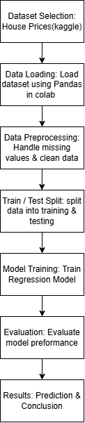

# ARTI308-House-Price-Prediction
## Nest & Worth: House Price Prediction
### Team Members:
1. **Nour Alhammadi** - ID: 2240002036
2. **Waad Alomar** - ID: 2240007034
4. **Fatima Adel Bahadi** - ID: 2240001143

### Introduction:
Machine Learning is a field of computer science that allows computers to learn from data and make predictions without being directly programmed for every task. It is widely used in many real-world applications such as business, healthcare, and finance. One important area where machine learning can be applied is the real estate market.
House prices are affected by several factors, including the size of the house, number of rooms, age of the property, and its location. Because many variables influence the final price, it can be difficult to estimate the value accurately without using data analysis techniques.
In this project, we apply supervised learning methods to build a regression model that predicts house prices based on selected features. The goal is to understand the relationship between house characteristics and their market value, and to show how machine learning can be used in a practical and meaningful way to solve real-world problems.

### Brainstorming
During the brainstorming stage, three different machine learning project ideas were discussed:
1. House Price Prediction using Machine Learning (Selected)
2. Restaurant Success Prediction
3. Personalized Workout Recommendation System

After evaluating the ideas based on data availability, complexity, and relevance to the course objectives, the house price prediction topic was selected.

##  Description of the Topic and Advantages
### House Price Prediction using Machine Learning
The "Nest & Worth" project aims to build a supervised machine learning regression model to predict house prices based on their physical and spatial characteristics, such as house size, number of rooms, building age, and geographic location. The model analyzes the relationship between these features and the market value of properties.
This project uses well-known regression techniques and evaluates model performance using standard quantitative metrics such as **Mean Absolute Error (MAE)** and **Root Mean Square Error (RMSE)**. The topic is easy to understand, widely used in academic research, and supported by reliable public datasets, making it suitable for demonstrating core machine learning concepts in a practical real-world context.

### Further Justification (Literature Review)
House price prediction is a widely studied problem in machine learning literature and is commonly used as a benchmark for regression models. Previous studies indicate that machine learning techniques can effectively capture the relationship between housing features and market prices. Due to its academic relevance, availability of datasets, and practical importance, this topic is considered worthwhile and appropriate for the objectives of the ARTI 308 course.

### Methodology Diagram

###This diagram illustrates the complete workflow for the "Nest & Worth" House Price Prediction project, from data acquisition to results.
### Diagram Steps:
1. **Dataset Selection:** Obtaining the "House Prices - Advanced Regression Techniques" dataset from Kaggle.
2. **Data Loading:** Importing `train.csv` using the Pandas library in Google Colab for initial analysis.
3. **Exploratory Data Analysis (EDA):** Inspecting the data using `df.head()`, `df.shape`, and `df.info()` to understand features and types.
4. **Data Preprocessing:** Handling missing values and cleaning the data to ensure model accuracy.
5. **Model Training:** Splitting the data and applying Regression algorithms to learn patterns between house features and prices.
6. **Model Evaluation:** Measuring performance using standard metrics: Mean Absolute Error (MAE) and Root Mean Square Error (RMSE).
7. **Results & Conclusion:** Generating price predictions and summarizing project findings.

### References
* Datasets from Kaggle
* ARTI 308: Machine Learning course materials
